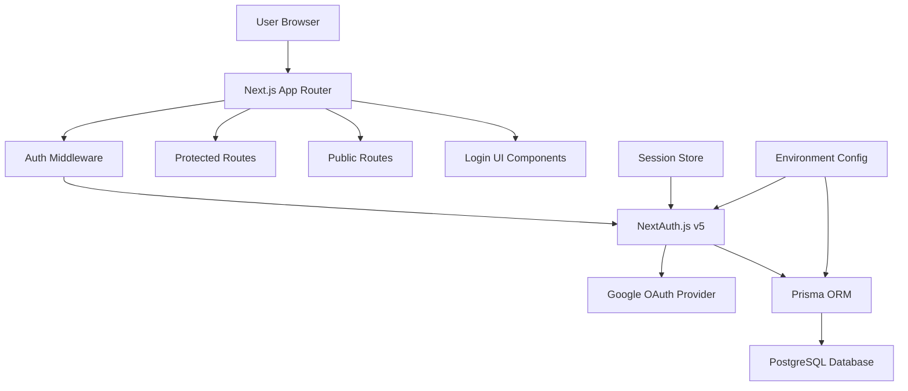
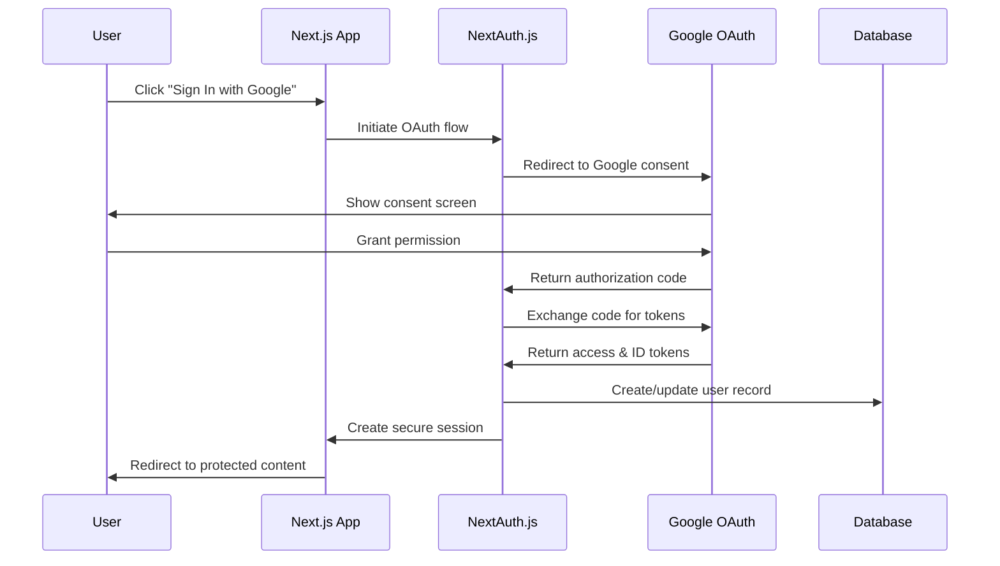

# Design Document: Google Sign-In Authentication with PostgreSQL Integration

## Overview

This design implements a comprehensive authentication system for the Tech Innovers Next.js application using Google OAuth 2.0 and PostgreSQL database integration. The system leverages NextAuth.js v5 (Auth.js) for authentication flows, Prisma ORM for database operations, and integrates seamlessly with the existing Transformers theme system.

The architecture follows modern security best practices including PKCE for OAuth flows, secure session management with HTTP-only cookies, and proper token validation. The design maintains the existing application structure while adding authentication capabilities through middleware-based route protection and header integration.

## Architecture

### High-Level Architecture



### Authentication Flow



## Components and Interfaces

### Core Authentication Components

**NextAuth Configuration (`auth.ts`)**
- Configures Google OAuth provider with client credentials
- Sets up Prisma database adapter for session persistence
- Defines session strategy and security settings
- Implements custom callbacks for user data handling

**Authentication Middleware (`middleware.ts`)**
- Protects routes based on authentication status
- Handles redirects for unauthenticated users
- Validates session tokens on each request
- Supports both protected and public route patterns

**Login Page Component (`/login/page.tsx`)**
- Renders Google Sign-In button with proper branding
- Handles authentication state and loading indicators
- Displays error messages for failed authentication
- Integrates with Transformers theme system

**Header Authentication Integration**
- Extends existing header component with auth status
- Shows user profile information when authenticated
- Provides sign-in/sign-out functionality
- Maintains existing navigation and theme toggle

### Database Layer Components

**Prisma Schema (`schema.prisma`)**
- Defines user, account, session, and verification token models
- Follows NextAuth.js database adapter requirements
- Includes proper indexes for query performance
- Supports PostgreSQL-specific features

**Database Connection (`db.ts`)**
- Manages Prisma client instance with connection pooling
- Handles database connection lifecycle
- Implements proper error handling and logging
- Supports environment-specific configurations

### UI Integration Components

**Authentication Provider (`auth-provider.tsx`)**
- Wraps application with session context
- Provides authentication state to all components
- Handles session updates and synchronization
- Integrates with existing React context patterns

**Protected Route Wrapper (`protected-route.tsx`)**
- Higher-order component for route protection
- Handles loading states during authentication checks
- Provides fallback UI for unauthenticated users
- Supports redirect after successful authentication

## Data Models

### User Model
```typescript
interface User {
  id: string              // Primary key, UUID
  email: string           // User's email from Google
  name: string | null     // Display name from Google profile
  image: string | null    // Profile picture URL from Google
  emailVerified: Date | null  // Email verification timestamp
  createdAt: Date         // Account creation timestamp
  updatedAt: Date         // Last update timestamp
}
```

### Account Model (OAuth Provider Data)
```typescript
interface Account {
  id: string              // Primary key, UUID
  userId: string          // Foreign key to User
  type: string            // Account type ("oauth")
  provider: string        // Provider name ("google")
  providerAccountId: string  // Google user ID
  refresh_token: string | null  // OAuth refresh token
  access_token: string | null   // OAuth access token
  expires_at: number | null     // Token expiration timestamp
  token_type: string | null     // Token type ("Bearer")
  scope: string | null          // OAuth scopes granted
  id_token: string | null       // Google ID token
  session_state: string | null  // OAuth session state
}
```

### Session Model
```typescript
interface Session {
  id: string              // Primary key, UUID
  sessionToken: string    // Unique session identifier
  userId: string          // Foreign key to User
  expires: Date           // Session expiration timestamp
}
```

### Verification Token Model
```typescript
interface VerificationToken {
  identifier: string      // Email or other identifier
  token: string          // Verification token
  expires: Date          // Token expiration timestamp
}
```

## Correctness Properties

*A property is a characteristic or behavior that should hold true across all valid executions of a system—essentially, a formal statement about what the system should do. Properties serve as the bridge between human-readable specifications and machine-verifiable correctness guarantees.*

### Property 1: Authentication Flow Completeness
*For any* valid Google OAuth response containing user profile information, the authentication system should successfully create or update a user record in the database and establish a secure session.
**Validates: Requirements 1.3, 1.4, 1.5**

### Property 2: Session Token Security
*For any* generated session token, it should be cryptographically secure, have appropriate expiration times, and be stored with secure HTTP-only cookie attributes.
**Validates: Requirements 2.1, 2.2, 7.1**

### Property 3: Session Validation Consistency
*For any* session token, validation should consistently return the same result (valid/invalid) based on the token's cryptographic integrity and expiration status.
**Validates: Requirements 2.3, 2.4, 7.2**

### Property 4: Session Lifecycle Management
*For any* user session, logout operations should immediately invalidate the session token, making subsequent validation attempts fail.
**Validates: Requirements 2.5**

### Property 5: User Data Management
*For any* user profile data from Google OAuth, the database layer should create new user records for first-time users and update existing records (including last login timestamp) for returning users while maintaining data integrity.
**Validates: Requirements 3.2, 3.3, 3.4**

### Property 6: Database Error Resilience
*For any* database operation failure, the system should handle errors gracefully without exposing sensitive information and log appropriate error details for debugging.
**Validates: Requirements 3.5**

### Property 7: Route Protection Enforcement
*For any* protected route access attempt, unauthenticated users should be redirected to the login page, while authenticated users with valid sessions should be granted access.
**Validates: Requirements 5.1, 5.3, 5.4, 5.5**

### Property 8: Post-Authentication Redirect
*For any* successful authentication following a protected route access attempt, users should be redirected to their originally requested page rather than a default location.
**Validates: Requirements 5.2**

### Property 9: OAuth Security Compliance
*For any* OAuth flow, the system should implement PKCE (Proof Key for Code Exchange) parameters correctly and validate all security tokens according to OAuth 2.0 specifications.
**Validates: Requirements 7.3**

### Property 10: Data Protection Standards
*For any* sensitive data stored in the database, appropriate encryption or hashing should be applied, and authentication event logging should not expose sensitive information.
**Validates: Requirements 7.4, 7.5**

## Error Handling

### Authentication Errors
- **OAuth Provider Errors**: Handle Google OAuth service unavailability, invalid credentials, and user consent denial
- **Token Validation Errors**: Manage expired tokens, malformed tokens, and signature verification failures
- **Session Errors**: Address session corruption, concurrent session conflicts, and session storage failures

### Database Errors
- **Connection Failures**: Implement connection retry logic with exponential backoff
- **Query Failures**: Handle constraint violations, data validation errors, and transaction rollbacks
- **Migration Errors**: Provide clear error messages for schema migration issues

### UI Error States
- **Network Errors**: Display user-friendly messages for connectivity issues
- **Authentication Failures**: Show specific error messages for different failure types
- **Loading States**: Implement proper loading indicators with timeout handling

### Configuration Errors
- **Missing Environment Variables**: Fail fast with clear error messages identifying missing configuration
- **Invalid Configuration**: Validate configuration values at startup and provide helpful error messages
- **Environment Mismatch**: Detect and warn about configuration mismatches between environments

## Testing Strategy

### Dual Testing Approach

The authentication system requires both unit testing and property-based testing for comprehensive coverage:

**Unit Tests** focus on:
- Specific OAuth flow scenarios (successful login, user denial, provider errors)
- UI component rendering in different authentication states
- Database connection establishment and error scenarios
- Configuration loading and validation edge cases
- Integration points between NextAuth.js and custom components

**Property-Based Tests** focus on:
- Universal authentication flow properties across all valid user profiles
- Session management behavior across all possible session states
- Route protection enforcement across all route configurations
- Security compliance across all token types and validation scenarios
- Data integrity across all database operations

### Property-Based Testing Configuration

**Testing Library**: Use `fast-check` for TypeScript property-based testing
**Test Configuration**: Minimum 100 iterations per property test
**Test Tagging**: Each property test must reference its design document property

**Tag Format**: `Feature: google-signin-auth, Property {number}: {property_text}`

**Property Test Requirements**:
- Each correctness property must be implemented by a single property-based test
- Tests must generate random but valid inputs for comprehensive coverage
- Tests must validate universal properties rather than specific examples
- Tests must be deterministic despite using randomization (seeded generators)

### Integration Testing

**End-to-End Authentication Flows**:
- Complete OAuth flow from login button click to authenticated session
- Route protection across different authentication states
- Theme integration across both default and Transformers themes
- Header integration with existing navigation components

**Database Integration**:
- User creation and update operations with real database connections
- Session storage and retrieval with PostgreSQL
- Migration testing with schema changes
- Connection pooling and error recovery

### Security Testing

**OAuth Security Validation**:
- PKCE parameter generation and validation
- Token signature verification and expiration handling
- Cross-site request forgery (CSRF) protection
- Secure cookie configuration and transmission

**Session Security Testing**:
- Session token entropy and unpredictability
- Session fixation attack prevention
- Concurrent session handling
- Session timeout and cleanup